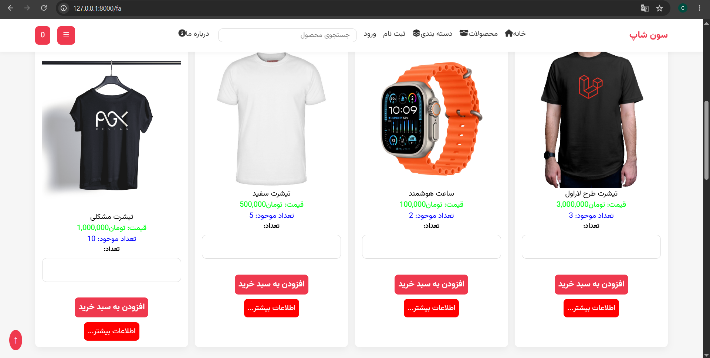
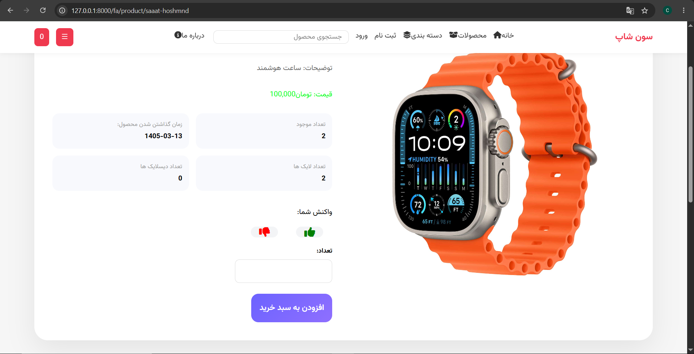
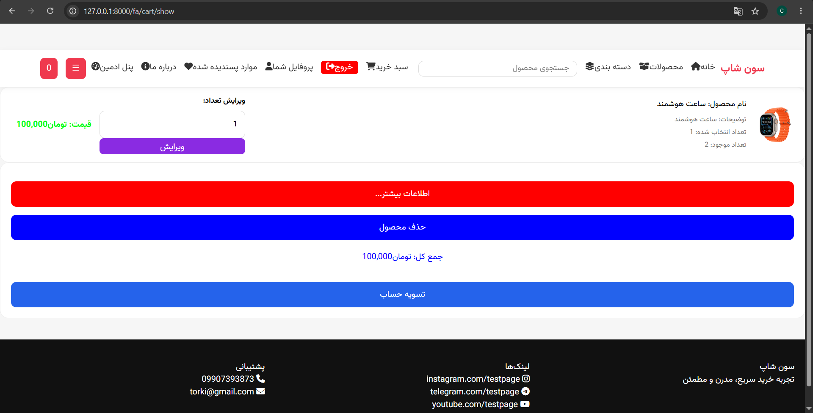
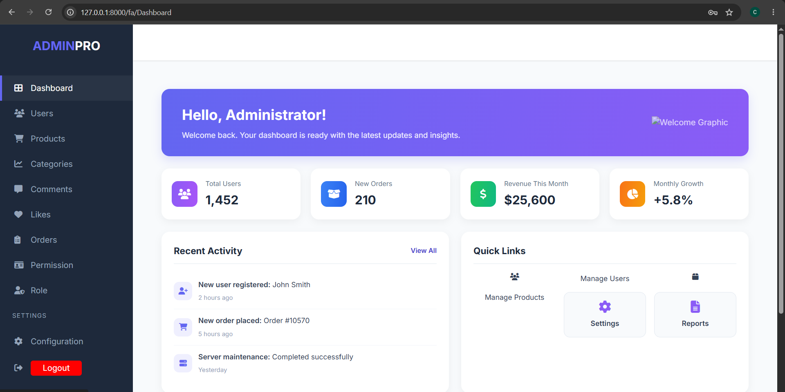

# 🚀 Seven Shop

<div align="center">

### Modern E-Commerce Platform Built With Laravel

Powerful • Scalable • SEO Optimized • Multi Language

---

🎥 **Project Demo**

👉 **[Watch Demo Video Here](https://youtu.be/oplCBZkElwE?is=At2HAJp50aQgweQS)**

</div>

---

## ✨ Overview

Seven Shop is a fully functional e-commerce platform developed using Laravel.

The project was built from scratch with a strong focus on:

* Clean Architecture
* Scalability
* Performance
* SEO Optimization
* User Experience

This project includes both a complete customer-facing storefront and an administration panel for managing products, categories and orders.

---

# 🔥 Core Features

## 🛍 Storefront

* Product Listing
* Product Details
* Category Pages
* Search System
* Shopping Cart
* Order Creation
* Responsive Design
* Multi Language Support
* SEO Friendly URLs

---

## ⚙ Admin Panel

* Product Management
* Category Management
* Order Management
* Dashboard
* Content Management

---

## 🌍 SEO Optimization

Implemented using Laravel SEO Tools.

Features:

* Dynamic Meta Title
* Dynamic Meta Description
* Canonical URLs
* Open Graph Tags
* SEO Friendly Slugs
* Image Alt Attributes
* Structured SEO Architecture

---

## 🧰 Tech Stack

| Technology           | Description          |
| -------------------- | -------------------- |
| Laravel              | Backend Framework    |
| PHP                  | Server Side Language |
| MySQL                | Database             |
| Blade                | Templating Engine    |
| Bootstrap            | Frontend UI          |
| Laravel Cache        | Performance          |
| Laravel Localization | Multi Language       |
| SEO Tools            | SEO Management       |

---

# 📸 Screenshots

## Homepage



---

## Product Page



---

## Shopping Cart



---

## Admin Dashboard



---

# 🎥 Demonstration

The complete project walkthrough is available below:

### ▶ Demo Video

https://youtu.be/oplCBZkElwE?is=At2HAJp50aQgweQS

---

# ⚡ Installation

```bash
git clone https://github.com/MOHAMAD138755/seven-shop.git

cd seven-shop

composer install

cp .env.example .env

php artisan key:generate

php artisan migrate

php artisan serve
```

---

# 📈 Project Status

```text
✔ Storefront Completed
✔ Admin Panel Completed
✔ Shopping Cart Completed
✔ SEO Completed
✔ Multi Language Completed
✔ Caching Completed
✔ Product Management Completed
✔ Category Management Completed
```

---

# 💳 Payment Gateway

Payment gateway integration was intentionally not activated because the project is running in a local development environment.

The payment workflow is fully prepared and can be connected to a production merchant account and domain at any time.

---

# 👨‍💻 Developer

### Your Name:  Mohamad Torki

GitHub:

https://github.com/MOHAMAD138755

---

<div align="center">

⭐ If you liked this project, consider giving it a star.

</div>
